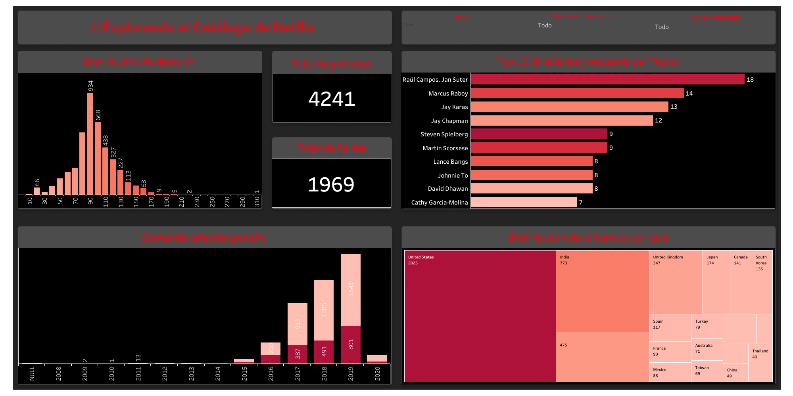

# 🎬 Netflix Dashboard en Tableau

Este proyecto presenta un **dashboard interactivo en Tableau** para analizar el catálogo de **Netflix**.  
El objetivo es **visualizar y explorar las tendencias de contenido** de la plataforma, incluyendo:  
- La distribución entre **películas y programas de TV**  
- Los **géneros más populares**  
- La **duración del contenido**  
- Los **directores más prolíficos**  

---

## 🔎 Hallazgos Clave

- **🎥 Dominio de Películas**  
  El catálogo está compuesto en su mayoría por **películas**, superando ampliamente a los programas de TV.  

- **📈 Crecimiento del Contenido**  
  Existe una tendencia ascendente en la cantidad de títulos añadidos anualmente, con **2019** como el año de mayor incorporación.  

- **🌍 Origen del Contenido**  
  **Estados Unidos** lidera la producción, seguido de **India**, **Reino Unido** y **Canadá**.  

- **🎭 Géneros más Populares**  
  **Drama** y **Comedia** son los géneros más comunes en la plataforma.  

- **⏱️ Duración Estándar**  
  La duración más frecuente de las películas se encuentra entre **90-100 minutos**.  

---

## 🛠️ Proceso de Construcción del Dashboard

### 1️⃣ Preparación de Datos
- **Limpieza:** Se cargó el archivo `netflix_titles.csv` en Tableau.  
- **Campos Calculados:** Se extrajo la duración de las películas en minutos y se dividió la columna `listed_in` para analizar géneros de forma individual.  

### 2️⃣ Creación de Visualizaciones
- 📊 **KPIs:** Recuento total de películas y programas de TV.  
- 📈 **Gráfico de Tendencia Anual:** Barras apiladas con títulos añadidos por año.  
- 🌍 **Mapa de Árbol:** Distribución del contenido por país.  
- ☁️ **Nube de Palabras:** Géneros más comunes según frecuencia.  
- 📏 **Histograma:** Distribución de la duración de las películas.  
- 🎬 **Top 10 Directores:** Gráfico de barras con los directores más prolíficos.  

### 3️⃣ Diseño y Publicación
- **Integración:** Todas las visualizaciones se unieron en un único dashboard.  
- **Filtros Globales:** Por `type`, `release_year` y `country`.  
- **Formato:** Colores y estilo alineados con la marca **Netflix**.  
- **Publicación:** Dashboard compartido en Tableau Public.  

---

## 🖼️ Captura de pantalla del dashboard  

  

---

## 🌐 Link a Tableau Public

Accede al dashboard completo en Tableau Public:  

👉 [Ver dashboard en Tableau Public](https://public.tableau.com/views/Netflix_17565206236860/Dashboard1?:language=es-ES&:sid=&:redirect=auth&:display_count=n&:origin=viz_share_link)  

---

## 🚀 Conclusión

Este proyecto demuestra cómo **Tableau** puede transformar un dataset como `netflix_titles.csv` en una herramienta visual poderosa para **identificar tendencias, patrones y comportamientos de consumo** en el catálogo de Netflix.  
